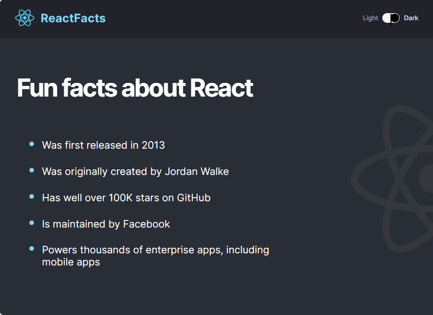

# React Facts site

## Description
A basic site presenting some facts about React. The page consists of two React components (Navbar and Main) which appearances could be toggled between Light and Dark mode, using the toggle switch at the upper right corner. Se images below.
 
 

## Technologies
- HTML
- CSS
- JavaScript
- React

## Live link
The site is deployed here:
[https://toms-reactfacts.netlify.app](https://toms-reactfacts.netlify.app)

Please feel free to visit the site!
